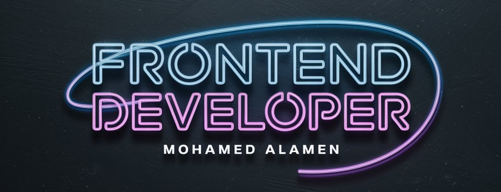

<!--
**Mohamed-SE23/Mohamed-SE23** is a ✨ _special_ ✨ repository because its `README.md` (this file) appears on your GitHub profile.

Here are some ideas to get you started:

- 🔭 I’m currently working on ...
- 🌱 I’m currently learning ...
- 👯 I’m looking to collaborate on ...
- 🤔 I’m looking for help with ...
- 💬 Ask me about ...
- 📫 How to reach me: ...
- 😄 Pronouns: ...
- ⚡ Fun fact: ... 

## 📌 Featured Projects:
- [AI Productivity Assistant]((https://ai-powered-productivity-assistant.vercel.app/)) – Built with React & Tailwind (for frontend), Node.js & express.js (for backend)
<!--
- [🌐 Portfolio Website](https://yourwebsite.com) – Built with React & Tailwind
- [🔐 Authentication System](https://github.com/your-repo) – Secure login using JWT  
- [🤖 AI Chatbot](https://github.com/your-repo) – AI-powered chatbot with OpenAI API
-->
<!--
## 📫 Let's Connect:
  
  
  

-->

<!-- # 💫 About Me: -->
## Hi, I'm Mohamed Alamen! 👋
🚀 Passionate Web Developer | React & Node.js Enthusiast   🎯 Currently learning: AI integration with web development   🔨 Working on exciting open-source projects  

# 💻 Tech Stack:
                               

## 🌐 Socials:
) 

### ✍️ Random Dev Quote

---

<picture>
  <source media="(prefers-color-scheme: dark)" srcset="https://raw.githubusercontent.com/Mohamed-SE23/Mohamed-SE23/output/github-snake-dark.svg" />
  <source media="(prefers-color-scheme: light)" srcset="https://raw.githubusercontent.com/Mohamed-SE23/Mohamed-SE23/output/github-snake.svg" />
  
</picture>

<!-- Proudly created with GPRM ( https://gprm.itsvg.in ) -->
